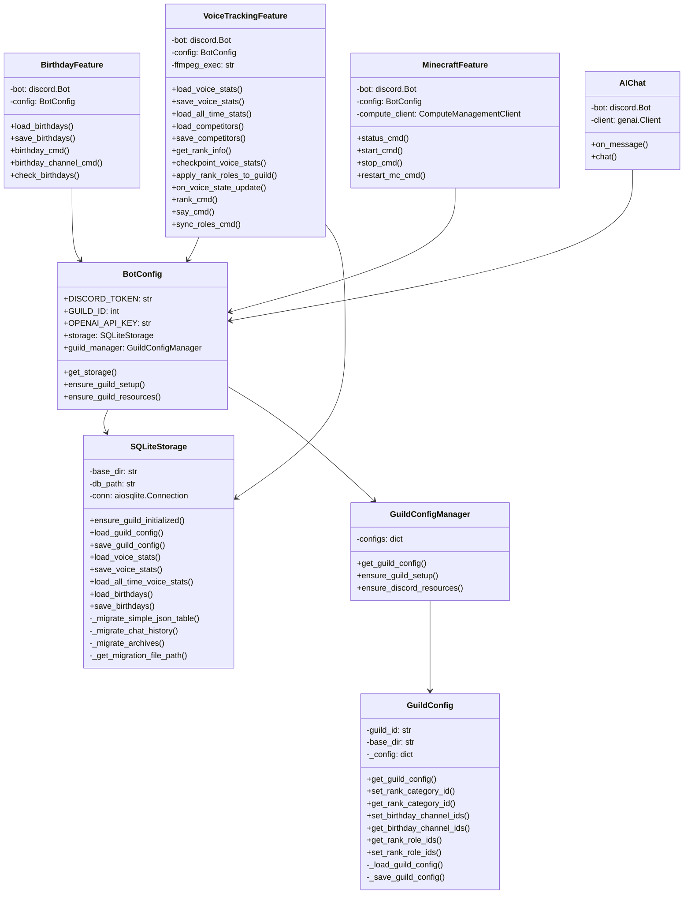
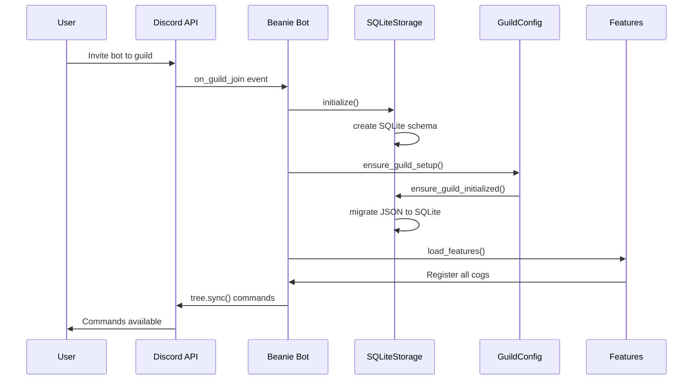
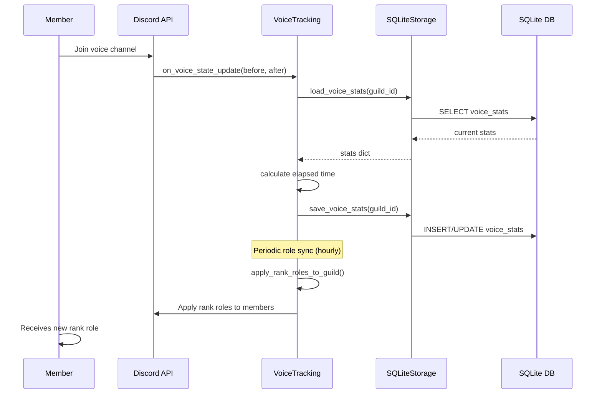
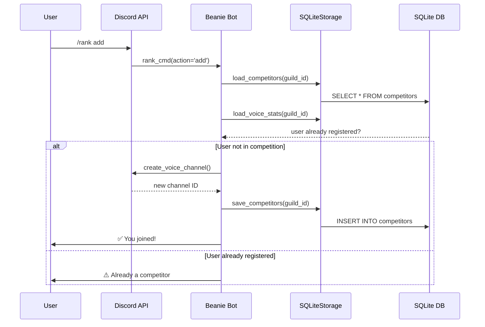
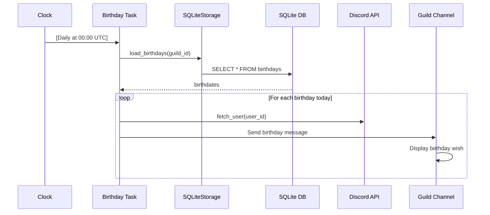

# Beanie Bot - Architecture Documentation

## Table of Contents
- [System Overview](#system-overview)
- [Class Diagram](#class-diagram)
- [Sequence Diagrams](#sequence-diagrams)
- [Data Flow](#data-flow)

---

## System Overview

Beanie Bot is a multi-feature Discord bot built with:
- **discord.py** - Discord API wrapper
- **SQLite** - Persistent data storage
- **Google GenAI** - AI chat functionality
- **Azure SDK** - Cloud infrastructure management
- **Python 3.12** - Runtime

### Architecture Layers

```
┌─────────────────────────────────────┐
│   Discord Bot Layer (main.py)       │
│   Command Tree & Event Handlers     │
└────────────────┬────────────────────┘
                 │
┌────────────────▼────────────────────┐
│   Feature Modules (features/*.py)   │
│  - VoiceTracking                    │
│  - Birthday Management              │
│  - Minecraft Server                 │
│  - AI Chat                          │
│  - Admin                            │
└────────────────┬────────────────────┘
                 │
┌────────────────▼────────────────────┐
│   Core Layer (core/*.py)            │
│  - Storage (SQLite Backend)         │
│  - Guild Config Management          │
│  - Bot Configuration                │
└────────────────┬────────────────────┘
                 │
┌────────────────▼────────────────────┐
│   Data Persistence                  │
│  - SQLite Database (beanie.sqlite3) │
│  - Legacy JSON Files (migration)    │
└─────────────────────────────────────┘
```

---

## Class Diagram



---

## Sequence Diagrams

### 1. Bot Startup Sequence



### 2. Voice Time Tracking Sequence



### 3. /rank Command Flow



### 4. Birthday Check Sequence



---

## Data Flow

### Voice Tracking Data Flow

```
Discord Event (voice state change)
    ↓
on_voice_state_update() handler
    ↓
checkpoint_voice_stats()
    ├→ SQLite: Load current voice_stats
    ├→ Calculate elapsed time
    └→ SQLite: Update voice_stats
    ↓
Hourly: update_leaderboard()
    ├→ Load current month stats
    └→ Update voice channel names
    ↓
Monthly: monthly_reset_check()
    ├→ Archive previous month stats
    └→ Reset current month stats
    ↓
Commands: /rank list
    ├→ Load all-time stats (current + archived)
    └→ Display leaderboard
```

### Data Persistence Flow

```
Application Startup
    ↓
SQLiteStorage._initialize()
    ├→ Open/Create beanie.sqlite3
    ├→ Create schema if missing
    └→ Set WAL mode for concurrency
    ↓
GuildConfig._load_guild_config()
    ├→ Check SQLite for existing config
    ├→ If missing: Check legacy JSON files
    └→ Migrate JSON → SQLite (if needed)
    ↓
Load/Save Data
    ├→ All reads from SQLite
    ├→ All writes to SQLite
    └→ Legacy JSON files remain for rollback
```

---

## Module Dependencies

```
main.py
├── core.config.BotConfig
│   ├── core.storage.SQLiteStorage
│   └── core.guild_config.GuildConfigManager
├── features.voice_track.VoiceTrackingFeature
├── features.birthday.BirthdayFeature
├── features.minecraft.MinecraftFeature
├── features.ai_chat.AIChat
└── features.admin.AdminFeature

core/storage.py
├── aiosqlite (async SQLite)
└── json (legacy file format)

core/guild_config.py
├── core.storage.SQLiteStorage
└── discord.py

features/voice_track.py
├── discord.py
├── core.config.BotConfig
├── gtts (text-to-speech)
└── discord.opus (audio codec)

features/birthday.py
├── discord.py
└── core.config.BotConfig

features/minecraft.py
├── discord.py
├── azure.identity (authentication)
├── azure.mgmt.compute (VM management)
├── mcstatus (server polling)
└── mcrcon (RCON commands)

features/ai_chat.py
├── discord.py
├── google.genai (Gemini API)
└── openai (OpenAI API)
```

---

## Error Handling & Recovery

```
┌─────────────────────────────────┐
│  Exception Occurs               │
└────────────┬────────────────────┘
             │
    ┌────────▼────────┐
    │  Logging Layer  │
    │  - Log error    │
    │  - Stack trace  │
    └────────┬────────┘
             │
    ┌────────▼─────────────────────┐
    │  Error Type Check            │
    └┬────────────┬────────────────┘
     │            │
  ┌──▼──┐    ┌────▼─────┐
  │Cmd  │    │System    │
  │Error│    │Error     │
  │     │    │          │
  │Reply│    │Retry/    │
  │User │    │Fallback  │
  └─────┘    └──────────┘
```

