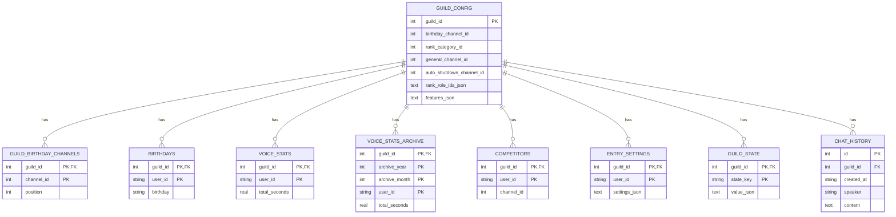

# Beanie Bot - Database Schema

## Overview

Beanie Bot uses **SQLite** as the primary data persistence layer with WAL mode enabled for concurrent access. Legacy JSON files are retained for migration and rollback purposes.

---

## Entity-Relationship Diagram



---

## Table Schemas

### 1. guild_config
**Purpose**: Store guild-wide configuration and resource IDs

```sql
CREATE TABLE IF NOT EXISTS guild_config (
    guild_id INTEGER PRIMARY KEY,
    birthday_channel_id INTEGER,           -- Discord channel ID for birthday announcements
    rank_category_id INTEGER,              -- Discord category ID for rank channels
    general_channel_id INTEGER,            -- Discord channel ID for hall of fame
    auto_shutdown_channel_id INTEGER,      -- Discord channel ID for shutdown notifications
    rank_role_ids_json TEXT NOT NULL,      -- JSON array of rank role IDs
    features_json TEXT NOT NULL            -- JSON object of feature flags/config
);
```

**Example Data**:
```json
{
    "guild_id": 1052940754600874105,
    "birthday_channel_id": 1054049999475965972,
    "rank_category_id": 1472493127934677185,
    "general_channel_id": 1475806362393907282,
    "rank_role_ids_json": "[1475819335514849391, 1475808729705353290, ...]",
    "features_json": "{\"voice_tracking\": true, \"birthdays\": true}"
}
```

---

### 2. guild_birthday_channels
**Purpose**: Track multiple birthday announcement channels (supports backup channels)

```sql
CREATE TABLE IF NOT EXISTS guild_birthday_channels (
    guild_id INTEGER NOT NULL,
    channel_id INTEGER NOT NULL,
    position INTEGER NOT NULL,             -- Priority order (0 = primary, 1, 2, ...)
    PRIMARY KEY (guild_id, channel_id)
);
```

**Query**: Get primary birthday channel
```sql
SELECT channel_id FROM guild_birthday_channels 
WHERE guild_id = ? ORDER BY position LIMIT 1;
```

---

### 3. birthdays
**Purpose**: Store user birthday dates for reminders

```sql
CREATE TABLE IF NOT EXISTS birthdays (
    guild_id INTEGER NOT NULL,
    user_id TEXT NOT NULL,                 -- Discord user ID as string
    birthday TEXT NOT NULL,                -- Format: dd/mm
    PRIMARY KEY (guild_id, user_id)
);
```

**Example Data**:
```
guild_id: 1052940754600874105
user_id: "298472648"
birthday: "25/12"
```

---

### 4. voice_stats (Current Month)
**Purpose**: Track voice channel time for current month

```sql
CREATE TABLE IF NOT EXISTS voice_stats (
    guild_id INTEGER NOT NULL,
    user_id TEXT NOT NULL,
    total_seconds REAL NOT NULL,           -- Cumulative seconds in voice for this month
    PRIMARY KEY (guild_id, user_id)
);
```

**Query**: Get monthly leaderboard
```sql
SELECT user_id, total_seconds FROM voice_stats 
WHERE guild_id = ? 
ORDER BY total_seconds DESC;
```

---

### 5. voice_stats_archive (Historical Data)
**Purpose**: Store historical voice time data for previous months

```sql
CREATE TABLE IF NOT EXISTS voice_stats_archive (
    guild_id INTEGER NOT NULL,
    archive_year INTEGER NOT NULL,         -- e.g., 2026
    archive_month INTEGER NOT NULL,        -- 1-12
    user_id TEXT NOT NULL,
    total_seconds REAL NOT NULL,
    PRIMARY KEY (guild_id, archive_year, archive_month, user_id)
);
```

**Query**: Get all-time stats
```sql
SELECT user_id, SUM(total_seconds) FROM (
    SELECT user_id, total_seconds FROM voice_stats WHERE guild_id = ?
    UNION ALL
    SELECT user_id, total_seconds FROM voice_stats_archive WHERE guild_id = ?
) GROUP BY user_id;
```

---

### 6. competitors
**Purpose**: Track who is in the voice competition and their channel

```sql
CREATE TABLE IF NOT EXISTS competitors (
    guild_id INTEGER NOT NULL,
    user_id TEXT NOT NULL,
    channel_id INTEGER,                    -- Discord voice channel ID for this user
    PRIMARY KEY (guild_id, user_id)
);
```

**Example Data**:
```
guild_id: 1052940754600874105
user_id: "298472648"
channel_id: 1472493127934700000
```

---

### 7. entry_settings
**Purpose**: Store per-user entrance sound preferences

```sql
CREATE TABLE IF NOT EXISTS entry_settings (
    guild_id INTEGER NOT NULL,
    user_id TEXT NOT NULL,
    settings_json TEXT NOT NULL,           -- JSON: {"enabled": bool, "sound_file": str}
    PRIMARY KEY (guild_id, user_id)
);
```

**Example Data**:
```json
{
    "guild_id": 1052940754600874105,
    "user_id": "298472648",
    "settings_json": "{\"enabled\": true, \"sound_file\": \"epic_entrance.mp3\"}"
}
```

---

### 8. guild_state
**Purpose**: Flexible KV store for guild-specific state

```sql
CREATE TABLE IF NOT EXISTS guild_state (
    guild_id INTEGER NOT NULL,
    state_key TEXT NOT NULL,               -- Key name (e.g., "last_leaderboard_update")
    value_json TEXT NOT NULL,              -- Any JSON-serializable value
    PRIMARY KEY (guild_id, state_key)
);
```

**Example**: Track last monthly reset
```json
{
    "guild_id": 1052940754600874105,
    "state_key": "last_monthly_reset",
    "value_json": "\"2026-03-01T00:00:00Z\""
}
```

---

### 9. chat_history
**Purpose**: Store chat message history for moderation/analytics

```sql
CREATE TABLE IF NOT EXISTS chat_history (
    id INTEGER PRIMARY KEY AUTOINCREMENT,
    guild_id INTEGER NOT NULL,
    created_at TEXT NOT NULL,              -- ISO 8601 timestamp
    speaker TEXT NOT NULL,                 -- Username or "unknown"
    content TEXT NOT NULL                  -- Message text
);
```

**Example Data**:
```
id: 1
guild_id: 1052940754600874105
created_at: "2026-03-15T14:30:00Z"
speaker: "Bean"
content: "Hello everyone!"
```

---

## Data Access Patterns

### 1. Voice Stats Update (Checkpoint)
```sql
-- Check if user already has stats
SELECT total_seconds FROM voice_stats 
WHERE guild_id = ? AND user_id = ?;

-- Insert or update
INSERT OR REPLACE INTO voice_stats (guild_id, user_id, total_seconds) 
VALUES (?, ?, ?);
```

### 2. Monthly Archive & Reset
```sql
-- Archive current month stats
INSERT INTO voice_stats_archive (guild_id, archive_year, archive_month, user_id, total_seconds)
SELECT ?, ?, ?, user_id, total_seconds FROM voice_stats WHERE guild_id = ?;

-- Reset current month
DELETE FROM voice_stats WHERE guild_id = ?;
```

### 3. All-Time Leaderboard
```sql
SELECT user_id, SUM(total_seconds) as all_time_seconds FROM (
    SELECT user_id, total_seconds FROM voice_stats WHERE guild_id = ?
    UNION ALL
    SELECT user_id, total_seconds FROM voice_stats_archive WHERE guild_id = ?
) GROUP BY user_id ORDER BY all_time_seconds DESC;
```

### 4. Check Birthday Today
```sql
SELECT user_id, birthday FROM birthdays 
WHERE guild_id = ? 
AND strftime('%m-%d', 'now') = substr(birthday, 4, 2) || '-' || substr(birthday, 1, 2);
```

---

## Performance Considerations

### Indexes
The primary keys provide automatic indexing on:
- `guild_config(guild_id)` - All guild-specific lookups
- `voice_stats(guild_id, user_id)` - Voice stats queries
- `competitors(guild_id, user_id)` - Competitor lookups
- `birthdays(guild_id, user_id)` - Birthday checks

### Concurrency
- **WAL Mode**: Enables concurrent read/write operations
- **Synchronous Mode**: NORMAL (balance between speed and safety)
- **Busy Timeout**: 5000ms for transient locks

### Storage
- **Typical DB Size**: ~5-10 MB per 10,000 users per 12 months
- **Archive Strategy**: Old archives can be manually pruned after 1 year

---

## Migration & Rollback

### JSON → SQLite Migration
```python
async def _ensure_guild_initialized(guild_id, guild_dir, default_config):
    # Load from SQLite if exists
    if config_row in sqlite:
        return existing_config
    
    # Fall back to legacy JSON
    json_file = guild_dir / "guild_config.json"
    if json_file.exists():
        config = load_json(json_file)
        await save_to_sqlite(config)
        return config
        
    # Use defaults
    return default_config
```

### Data Backup Strategy
1. **Automated**: Database backed up before major operations
2. **Manual**: `cp data/beanie.sqlite3 data/beanie.sqlite3.bak_TIMESTAMP`
3. **Rollback**: Replace SQLite file from backup, restart bot

---

## Legacy Data Formats

### JSON Structure (Pre-SQLite)
```
data/
├── guilds/
│   └── 1052940754600874105/
│       ├── guild_config.json
│       ├── birthdays.json
│       ├── voice_stats.json
│       ├── competitors.json
│       ├── entry_settings.json
│       ├── state.json
│       ├── chat_history.txt
│       └── archive_2026_02.json
└── beanie.sqlite3 (current)
```

All legacy files remain after migration for safety and reference.

